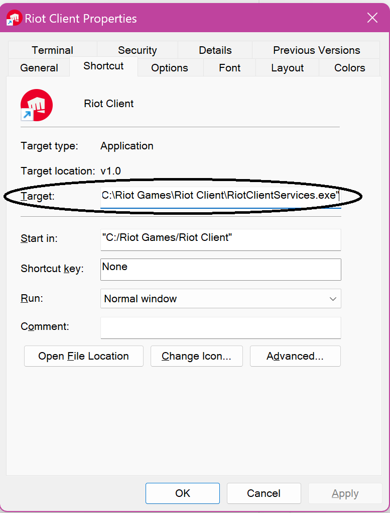
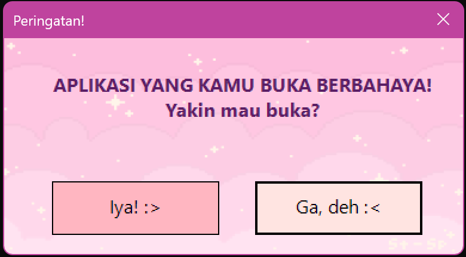
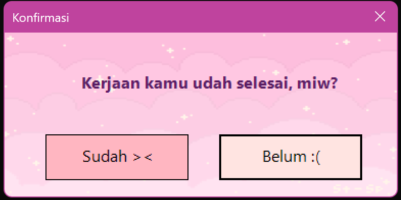
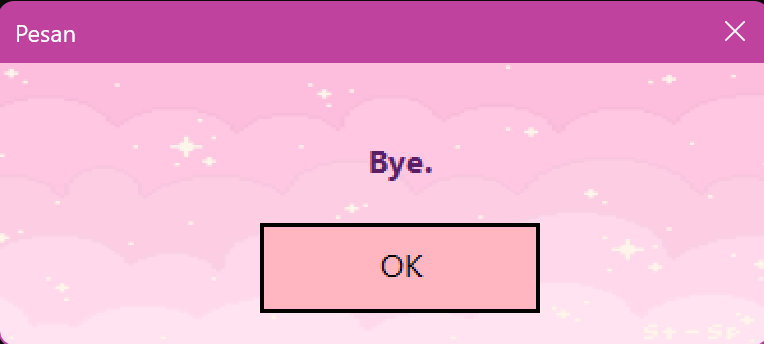

# ⚠️ Aplikasi Warning PowerShell  

Skrip PowerShell ini menampilkan peringatan sebelum menjalankan aplikasi tertentu.  

---

## ✨ Fitur  
✔ Menampilkan peringatan dengan UI Windows Forms  
✔ Meminta konfirmasi sebelum menjalankan aplikasi  
✔ Menggunakan gambar custom sebagai background (opsional)  

---

## 🚀 Cara Menggunakan  

### 1️⃣ **Download atau Clone Repo Ini**  
Buka PowerShell atau Command Prompt, lalu jalankan:  
```sh
git clone https://github.com/username/aplikasi-warning.git
cd aplikasi-warning
```

---

### 2️⃣ **Salin Path Skrip PowerShell**  
- Temukan file `AppWarning.ps1`  
- **Copy Path** skrip dengan cara:  
  - **Shift + Klik Kanan → Copy as Path**  
  - Path ini akan digunakan di langkah berikutnya.

---

### 3️⃣ **Ubah Shortcut Aplikasi yang Akan Diberi Warning**  
- Klik kanan pada shortcut aplikasi → **Properties**  
- Pada kolom **Target**, ubah menjadi:  
  ```sh
  C:\Windows\System32\WindowsPowerShell\v1.0\powershell.exe -ExecutionPolicy Bypass -File "C:\Path\Ke\AppWarning.ps1" "C:\Path\Ke\Aplikasi.exe"
  ```
  📌 **Ganti `C:\Path\Ke\AppWarning.ps1` dengan path yang sudah disalin di langkah 2.**

  

- **Contoh Sebelum & Sesudah pada shortcut Riot Client:**  
  Sebelum perubahan, shortcut hanya berisi:  
  ```sh
  "C:\Riot Games\Riot Client\RiotClientServices.exe"
  ```
  Setelah diubah, menjadi:  
  ```sh
  C:\Windows\System32\WindowsPowerShell\v1.0\powershell.exe -ExecutionPolicy Bypass -File "C:\Users\amira\warn\AppWarning.ps1" "C:\Riot Games\Riot Client\RiotClientServices.exe"
  ```

  **Gambar Ilustrasi:**  
  
  
  
  

---

## 🎨 Mengubah Background Warning  
Jika ingin mengganti gambar background pada peringatan:  
1. **Siapkan gambar yang ingin digunakan** (format `.jpg` atau `.png`).  
2. **Buka `AppWarning.ps1` dengan editor teks (Notepad/VS Code)**.  
3. **Cari baris berikut di dalam skrip:**  
   ```powershell
   $imagePath = "assets/bg.jpg"
   ```
4. **Ganti dengan path gambar yang baru**, misalnya:  
   ```powershell
   $imagePath = "C:\Users\amira\Pictures\warning_bg.png"
   ```
5. **Simpan file, dan coba jalankan ulang shortcut**.  

---

## 🛠️ Penjelasan Perintah  
| **Bagian** | **Penjelasan** |  
|------------|--------------|  
| `C:\Windows\System32\WindowsPowerShell\v1.0\powershell.exe` | Menjalankan **PowerShell.exe** yang ada di sistem Windows. Ini memastikan skrip dijalankan dengan PowerShell, meskipun ada versi lain yang diinstal. |  
| `-ExecutionPolicy Bypass` | Mengabaikan kebijakan eksekusi PowerShell sementara, memungkinkan skrip berjalan tanpa perlu mengubah pengaturan sistem secara permanen. |  
| `-File "C:\Users\amira\warn\AppWarning.ps1"` | Menunjukkan **file skrip PowerShell** yang akan dijalankan. Dalam contoh ini, skrip ada di `C:\Users\amira\warn\AppWarning.ps1`. |  
| `"C:\Path\Ke\Aplikasi.exe"` | Parameter tambahan yang dikirim ke skrip, yaitu path ke aplikasi yang ingin dijalankan setelah peringatan muncul. |  

---

<!--  
## 🎬 Video Tutorial dan Demo  
📺 **Tonton Tutorial di YouTube**: [Klik di sini](https://www.youtube.com/watch?v=contoh-link)  
-->

---


## 📜 Lisensi  
**© 2025 Amiw Dzh**  
Diberikan izin untuk menggunakan, menyalin, memodifikasi, menggabungkan, menerbitkan, mendistribusikan, memberikan lisensi, dan menjual salinan perangkat lunak ini.  

---

### 📌 **Catatan**  
- Jika skrip tidak bisa dijalankan, pastikan PowerShell mengizinkan eksekusi skrip dengan menjalankan:  
  ```sh
  Set-ExecutionPolicy Unrestricted -Scope CurrentUser
  ```
- Jika ada masalah, silakan buka **Issues** atau ajukan **Pull Request** di repo ini.  
