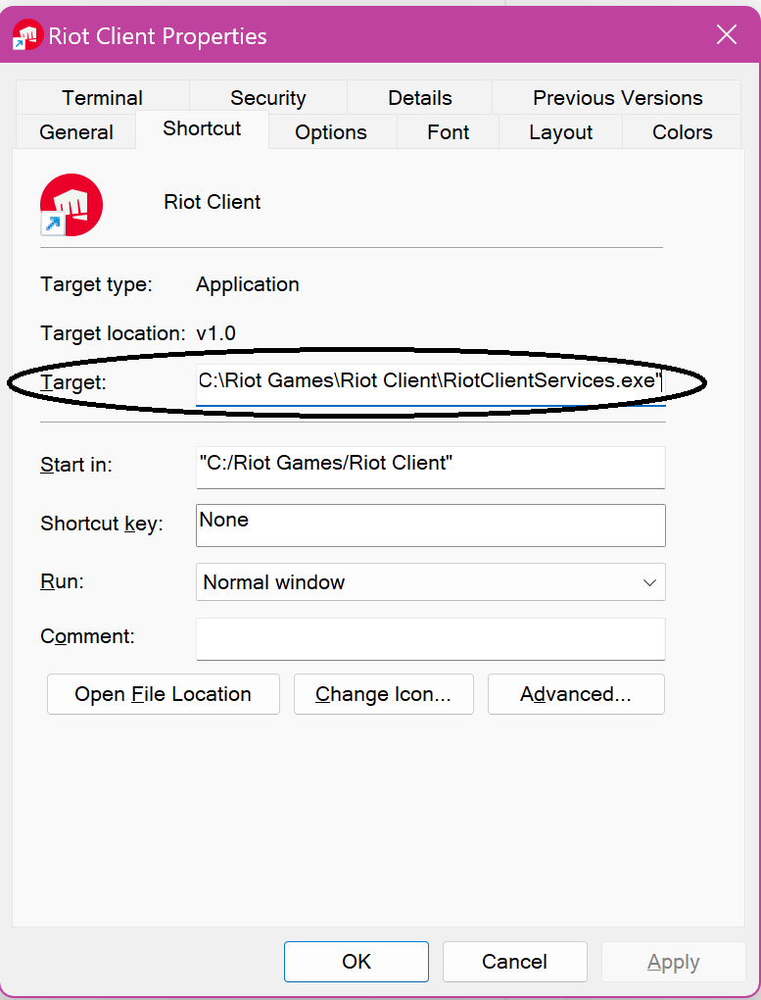
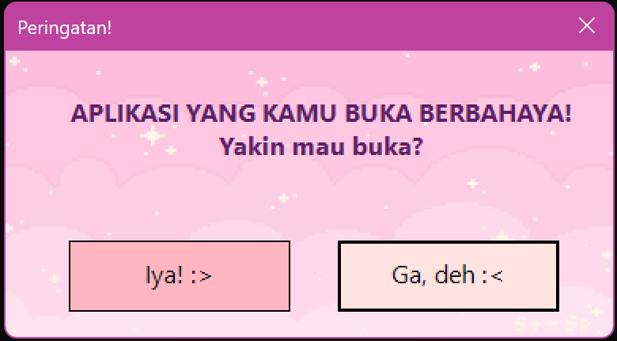
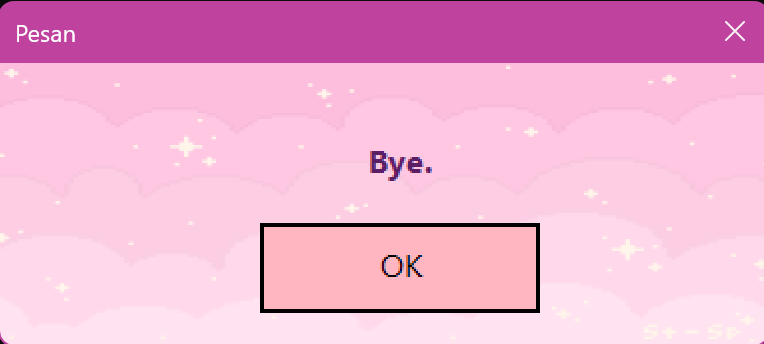

# ⚠️ Application Warning PowerShell  

This PowerShell script displays a warning before launching a specific application.  

---

## ✨ Features  
✔ Displays a warning with a Windows Forms UI  
✔ Asks for confirmation before running the application  
✔ Supports custom background images (optional)  

---

## 🚀 How to Use  

### 1️⃣ **Download or Clone This Repository**  
Open **PowerShell** or **Command Prompt**, then run:  
```sh
git clone https://github.com/username/app-warning.git
cd app-warning
```

---

### 2️⃣ **Copy the PowerShell Script Path**  
- Locate the file **`AppWarning.ps1`**  
- **Copy the file path** using:  
  - **Shift + Right Click → Copy as Path**  
  - This path will be used in the next step.  

---

### 3️⃣ **Modify the Application Shortcut**  
- Right-click on the application shortcut → **Properties**

   
  
- In the **Target** field, replace the existing value with:  
  ```sh
  C:\Windows\System32\WindowsPowerShell\v1.0\powershell.exe -ExecutionPolicy Bypass -File "C:\Path\To\AppWarning.ps1" "C:\Path\To/Application.exe"
  ```
  📌 **Replace `C:\Path\To\AppWarning.ps1` with the copied script path from Step 2.**  

- **Example Before & After (Riot Client shortcut):**  
  **Before:**  
  ```sh
  "C:\Riot Games\Riot Client\RiotClientServices.exe"
  ```
  **After:**  
  ```sh
  C:\Windows\System32\WindowsPowerShell\v1.0\powershell.exe -ExecutionPolicy Bypass -File "C:\Users\amira\warn\AppWarning.ps1" "C:\Riot Games\Riot Client\RiotClientServices.exe"
  ```

---

## 🎨 Customizing the Warning Background  
If you want to change the warning background image:  
1. **Prepare a new image** (`.jpg` or `.png` format).  
2. **Open `AppWarning.ps1` in a text editor (Notepad/VS Code)**.  
3. **Find the following line:**  
   ```powershell
   $imagePath = "assets/bg.jpg"
   ```
4. **Replace it with your image path**, e.g.:  
   ```powershell
   $imagePath = "C:\Users\amira\Pictures\warning_bg.png"
   ```
5. **Save the file and test the shortcut again**.  

---

## 🛠️ Command Breakdown  
| **Part** | **Explanation** |  
|------------|--------------|  
| `C:\Windows\System32\WindowsPowerShell\v1.0\powershell.exe` | Runs **PowerShell.exe** from the Windows system directory. This ensures the script runs using PowerShell, even if another version is installed. |  
| `-ExecutionPolicy Bypass` | Temporarily bypasses PowerShell’s execution policy, allowing the script to run without permanently changing system settings. |  
| `-File "C:\Users\amira\warn\AppWarning.ps1"` | Specifies the **PowerShell script** to be executed. In this example, the script is located at `C:\Users\amira\warn\AppWarning.ps1`. |  
| `"C:\Path\To\Application.exe"` | Additional parameter passed to the script, specifying the target application to be launched after the warning. |  

---


## 🎬 Video Tutorial and Demo  
📺 **Watch the tutorial on YouTube**: [Click Here](https://www.youtube.com/watch?v=example-link)  

  **Illustration:**  
  
  
  
  
  


---

## 📜 License  
**© 2025 Amiw Dzh**  
Permission is granted to use, copy, modify, merge, publish, distribute, sublicense, and sell copies of this software.  

---

### 📌 **Notes**  
- If the script does not run, ensure PowerShell allows script execution by running:  
  ```sh
  Set-ExecutionPolicy Unrestricted -Scope CurrentUser
  ```
- If you encounter any issues, feel free to open an **Issue** or submit a **Pull Request**.  
